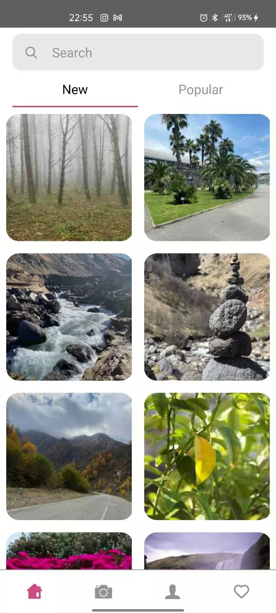
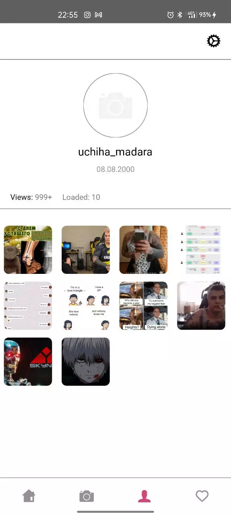

# GalleryApp

Приложение галлерея с функционалом регистрации, авторизации и отправки фото. При написании проекта были использованы принципы чистой архитектуры и MVVM.

В api использованном для написания проекта используется протокол авторизации OAuth 2, для рефреша токена был использован интерфес Authenticator из OkHttp3.

Для верстки экранов был использован императивный(view) подход. Приложение написано по принципу Single Activity. Для навигации по фрагментам используется Fragment Api, 
для реализации асинхронности - библеотека RxJava3, для запросов в сеть - Retrofit. DI - Dagger2.

## Стек использованных технологий

- RxJava3
- RxBinding
- Retrofit
- OkHttp
- SwipeRefreshLayout
- Dagger2
- Glide
- Realm

## Скриншоты

   
   
   
    
   
   
   
    
   
   
   

 

